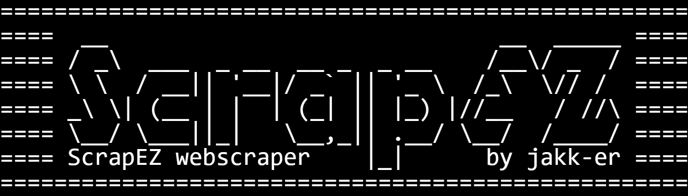

# This work is licensed under a Creative Commons Attribution 4.0 International License.
# You must give appropriate credit, provide a link to the license, and indicate if changes were made.
# Details: https://creativecommons.org/licenses/by/4.0/

<!---
===================================================
====  __                             __  _____ ====
==== / _\  ___  _ __  __ _  _ __    /__\/ _  / ====
==== \ \  / __|| '__|/ _` || '_ \  /_\  \// /  ====
==== _\ \| (__ | |  | (_| || |_) |//__   / //\ ====
==== \__/ \___||_|   \__,_|| .__/ \__/  /____/ ====
==== ScrapEZ webscraper    |_|      by jack-er ====
===================================================
--->

ScrapEZ Web Scraping Tool
================================

**Description**
This is a web scraping tool that allows you to extract links and data from a website. The tool provides four scraping methods:

1. **Scrape subdomain links**
2. **Scrape pages links**
3. **Scrape robots.txt**
4. **Scrape embedded links**

**Installation**
--------------

To use the ScrapEZ web scraping tool, follow these steps:

1. **Clone the repository**: Run `git clone https://github.com/jakk-er/ScrapEZ.git` to clone the repository to your local machine.
2. **Install dependencies**: Run `pip install -r requirements.txt` to install the required dependencies, including `requests`, `beautifulsoup4`, `urllib.parse`, `time`, and `collections`.
3. **Run the script**: Run `python scrapez.py`.

**Note**: Make sure you have Python installed on your system, along with the required dependencies. If you're using a virtual environment, activate it before running the script.

**Usage**
---------

Run the script and enter the website URL when prompted.
Choose which scraping methods to use by entering the corresponding numbers (separated by commas).
The tool will extract the requested data and print it to the console.

**Example Usage**

Here are some example usage scenarios:

* To scrape subdomain links and pages links from `https://example.com`, enter: https://example.com 1,2 `or` example.com 1,2

* To scrape robots.txt and embedded links from `https://www.example.net`, enter: https://www.example.net 3,4 `or` www.example.net 3,4

* To scrape all available data from `https://subdomain.example.io`, enter: https://subdomain.example.io 1,2,3,4 `or` subdomain.example.io 1,2,3,4

**License**
---------

This software is licensed under the MIT License. See the LICENSE file for details.

**Educational Use Only**
------------------------

This software is intended for educational purposes only. You agree to use the software solely for educational, research, or academic purposes, and not for any commercial or malicious activities.

**No Liability for Misuse**
---------------------------

You acknowledge that you are solely responsible for any misuse of the software, including but not limited to using it to target websites or systems without their permission. The authors and copyright holders shall not be liable for any damages or claims arising from such misuse.

**Modification Restrictions**
---------------------------

You are permitted to modify the software for your own educational purposes, but you agree not to modify the software in a way that would compromise its integrity or security. You also agree not to remove or alter any copyright notices, trademarks, or other proprietary rights notices from the software.

**Dependencies**
--------------

This software requires the following dependencies:

1. `requests`
2. `beautifulsoup4`
3. `urllib.parse`
4. `time`
5. `collections`

**Author**
---------

jack-er

**Version**
---------

1.0
